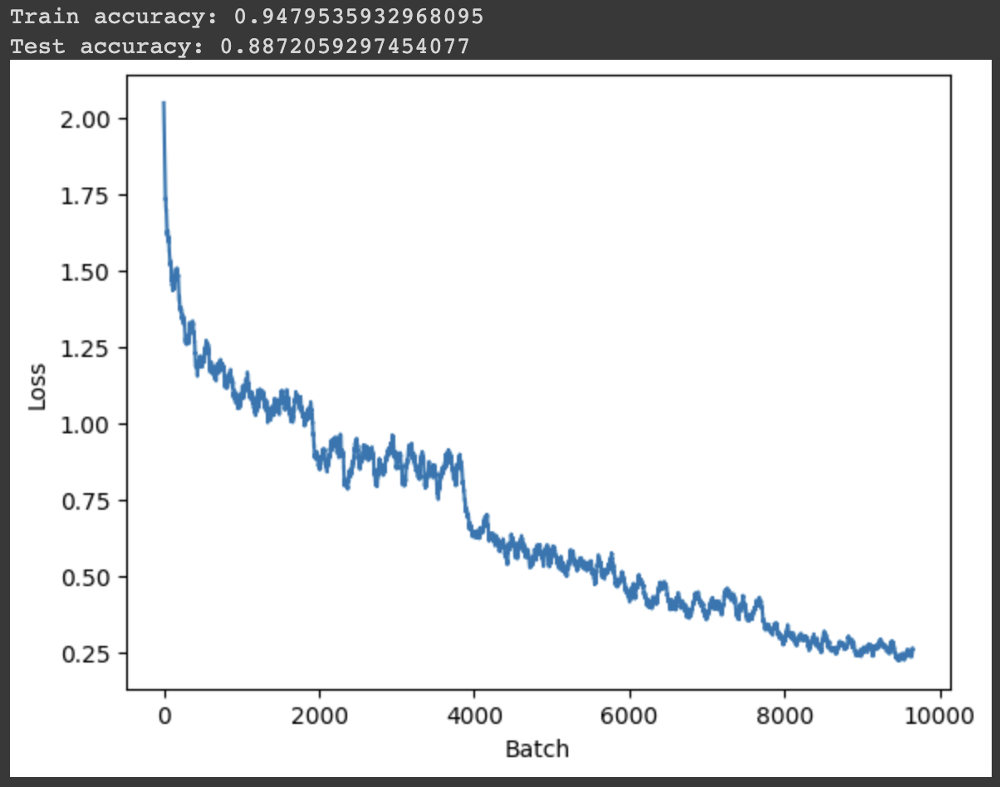

# **Garbage Classifier**

## **Inspiration**
After spending almost 3 years in the Seattle, I realised that I got into a habit of following careful waste segregation practices that I never practiced where I came from. After talking to my friends from India, I realised that the biggest issue for this disparity was the fact that most people in India didn't know proper waste management and didn't really care to find out. Therefore, I decided to create this project to create a classifier that can take an user's image to classify garbage and then segregate them into their respective categories.

## Dataset

I used a kaggle dataset with 15,150 images and 12 classes:
- Battery(945)
- Biological(985)
- brown-glass(607)
- cardboard(891)
- clothes(5325)
- green-glass(629)
- metal(769)
- paper(1050)
- plastic(865)
- shoes(1977)
- trash(697)
- white-glass(775)

Link to the dataset: https://www.kaggle.com/datasets/mostafaabla/garbage-classification

## Strategy

Firstly, I imported the data onto a google colab session and performed some data augmentation on the data set. For the training data, I employed resizing of the image into a 3x128x128 image (CxHxW format), random crop with a 4px padding, random horizontal flips, random perspective transformation, random rotation, and random shear. I then split the data set into train and test sets with a 20% split ratio.

Following that, I  created the classifier model. The model has 5 convoluted layers. The first 3 layers perform 2D convolutions, followed by batch normalization, activation function (ReLU), and max pooling. The last 2 layer use a ResNeXt block, and finally we perform average pooling and use a linear layer to get the output.

Next, I created my training function that creates checkpoints every epoch (to reset state since colab has a timeout) and also uses a learning rate schedule to change the learning rate for a particular range of epochs. I also created an accuracy function to test my model.

Lastly, I trained my model on my training set and found the following results:

 

### [Video Explanation](https://youtu.be/slA0HhrZkVY)
### [Alternate Video Download Link](https://drive.google.com/file/d/12njE5uI_Pbcch-WY58g3Sirc3IFW3Pmh/view?usp=sharing)

## Future Improvements

- Increasing size of model and adding more images for tougher classes such as white-glass, biological, and trash.
- Adding more layers, adding more epochs and tuning the hyperparameters further to increase model accuracy.
- Utilising a stronger method for resizing images to avoid issues created by blurred resized images.

## Resources

I drew inspiration from my CSE 455 coursework and example notebooks to understand how to train a model,  calculate accuracies, and perform data augmentations. I also used Papers With Code to get a deeper understanding of how the ResNeXt block works. I also understood PyTorch's source code for [ResNet](https://pytorch.org/vision/main/_modules/torchvision/models/resnet.html) to manipulate it and create my ResNeXt block.
